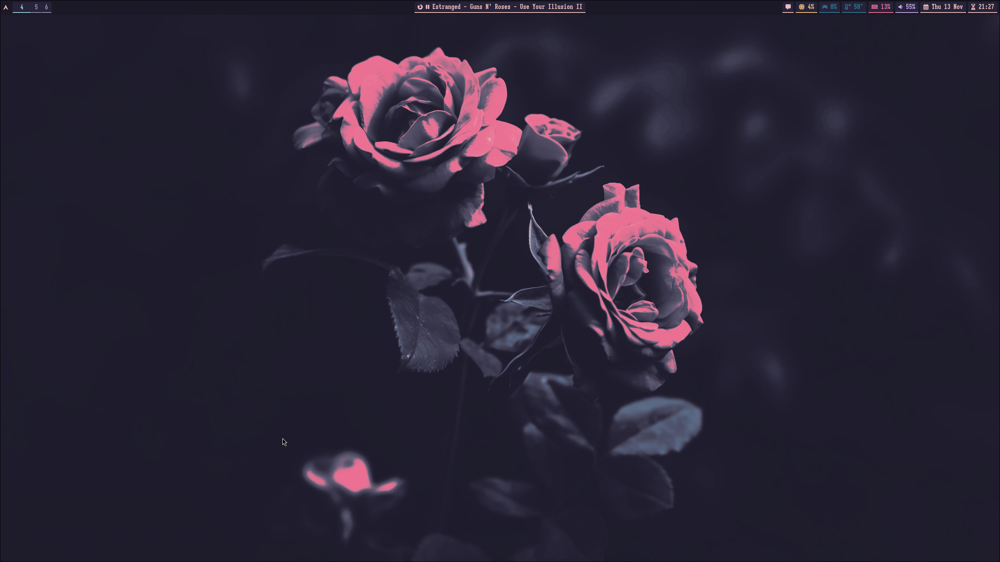

# Dotfiles

Personal dotfiles for [Hyprland](https://hyprland.org/) and Rosé Pine based theme.



## Key Bindings

| Keybind                       | Action                              |
|-------------------------------|-------------------------------------|
| SUPER + T                     | Open terminal special workspace     |
| SUPER + B                     | Open browser                        |
| SUPER + E                     | Open file explorer                  |
| SUPER + Q                     | Open notifications panel            |
| SUPER + M                     | Open emoji selector                 |
| SUPER + Space                 | Open app launcher                   |
| SUPER + C                     | Kill active window                  |
| SUPER + F4                    | Exit session                        |
| SUPER + V                     | Toggle floating                     |
| SUPER + P                     | Toggle pseudo                       |
| SUPER + A                     | Swap next window                    |
| SUPER + U                     | Increase split ratius               |
| SUPER + [h/j/k/l]             | Move window focus                   |
| SUPER + [0-9]                 | Switch between workspaces           |
| SUPER + SHIFT + T             | Open terminal                       |
| SUPER + SHIFT + B             | Open web search bar                 |
| SUPER + SHIFT + L             | Lock screen                         |
| SUPER + SHIFT + A             | Swap previous window                |
| SUPER + SHIFT + U             | Decrease split radius               |
| SUPER + SHIFT + J             | Toggle split direction              |
| SUPER + SHIFT + S             | Run Hyprshot region mode            |
| SUPER + SHIFT + [0-9]         | Move active window to a workspace   |
| SUPER + [Left Mouse Button]   | Drag to move window                 |
| SUPER + [Right Mouse Button]  | Drag to resize window               |

### Active Window Resizing

| Keybind                       | Action                              |
|-------------------------------|-------------------------------------|
| SUPER + R                     | Enter active window resizing mode   |

On resizing mode:

| Keybind | Action              |
|---------|---------------------|
| h / l   | Resize horizontally |
| j / k   | Resize vertically   |
| r       | Exit resizing mode  |

## Dependencies

| Group                         | Packages                                                                                    |
|-------------------------------|---------------------------------------------------------------------------------------------|
| **Hyprland and related**       | hyprland, hyprpaper, hyprlock, hyprshot, xdg-desktop-portal-hyprland                       |
| **Fonts and icon themes**      | ttf-iosevkaterm-nerd, ttf-nerd-fonts-symbols, noto-fonts-cjk, noto-fonts-emoji, noto-fonts |
| **UI packages**                | waybar, rofi, swaync, rofimoji                                                             |
| **Terminal emulators**         | wezterm, zellij, fish, starship                                                            |
| **TUI applications**           | yazi, fastfetch, btop, lazygit, bat, fzf, ripgrep, zoxide                                  |
| **Miscellaneous tools**        | nautilus, gvfs-mtp, imv, udiskie, nwg-look                                                 |
| **Themes (pacman + paru)**     | xdg-desktop-portal-gtk, rose-pine-gtk-theme-full                                           |

## Installation

Clone it in your home directory:

```bash
cd && git clone git@github.com:hbacelar8/.dotfiles.git
```

Make script executable and run it:

```bash
chmod +x install.sh
```

```bash
sudo ./install.sh
```
