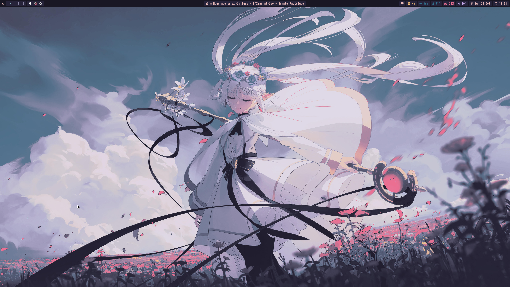

# Dotfiles

Personal dotfiles for [Hyprland](https://hyprland.org/) and Catppuccin Mocha
based theme.



## Key Bindings

| Keybind                       | Action                              |
|-------------------------------|-------------------------------------|
| SUPER + T                     | Open terminal (Wezterm)             |
| SUPER + C                     | Kill active window                  |
| SUPER + V                     | Toggle floating                     |
| SUPER + P                     | Toggle pseudo                       |
| SUPER + J                     | Swap split direction                |
| SUPER + A                     | Swap split positions                |
| SUPER + B                     | Open browser (Firefox)              |
| SUPER + L                     | Lock screen (Hyprlock)              |
| SUPER + Q                     | Open notifications panel            |
| SUPER + SHIFT + S             | Run Hyprshot region mode            |
| SUPER + Space                 | Open app launcher (Rofi)            |
| SUPER + M                     | Open emoji selector (Rofimoji)      |
| SUPER + SHIFT + [h/j/k/l]     | Move window focus                   |
| SUPER + [0-9]                 | Switch between workspaces           |
| SUPER + SHIFT + [0-9]         | Move active window to a workspace   |
| SUPER + [Left Mouse Button]   | Drag to move window                 |
| SUPER + [Right Mouse Button]  | Drag to resize window               |

## Dependencies

| Group                         | Packages                                                                                      |
|-------------------------------|-----------------------------------------------------------------------------------------------|
| **Hyprland and related**       | hyprland, hyprpaper, hyprlock, hyprshot, xdg-desktop-portal-hyprland                          |
| **Fonts and icon themes**      | ttf-iosevkaterm-nerd, ttf-nerd-fonts-symbols, noto-fonts-cjk, noto-fonts-emoji, noto-fonts, papirus-icon-theme |
| **UI packages**                | waybar, rofi, swaync, rofimoji                                                                |
| **Terminal emulators**         | wezterm, zellij                                                                              |
| **TUI applications**           | yazi, fastfetch, btop, lazygit, bat, fzf, ripgrep                                            |
| **Miscellaneous tools**        | nautilus, gvfs-mtp, imv, udiskie                                                             |
| **Themes (pacman + paru)**     | xdg-desktop-portal-gtk, catppuccin-gtk-theme-mocha                                            |

## Installation

Clone it in your home directory:

```bash
cd && git clone git@github.com:hbacelar8/.dotfiles.git
```

Make script executable and run it:

```bash
chmod +x install.sh
```

```bash
sudo ./install.sh
```
