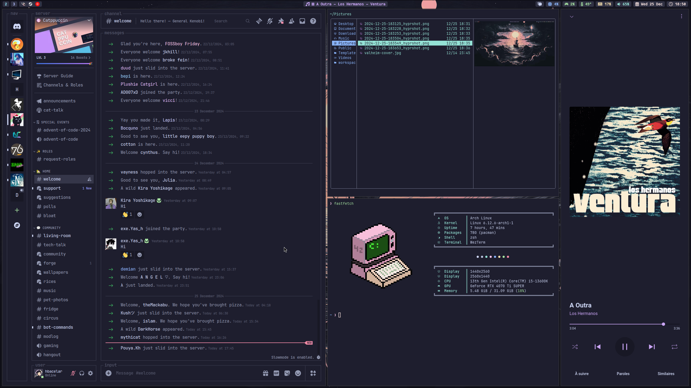
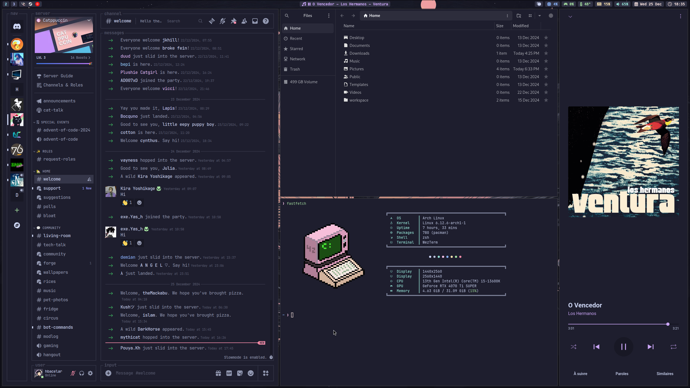
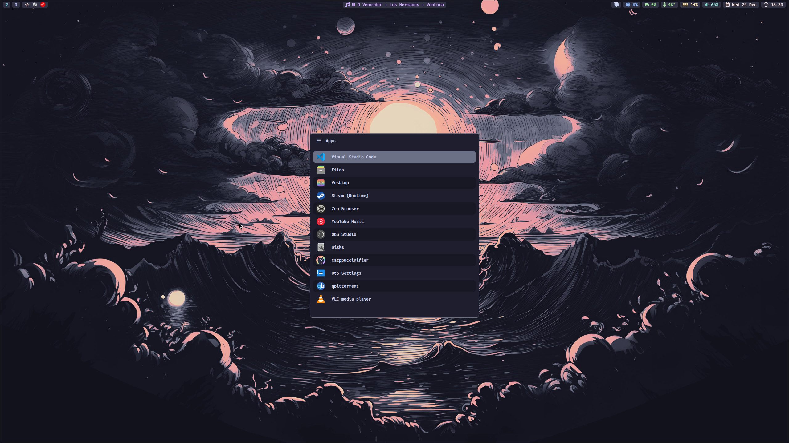
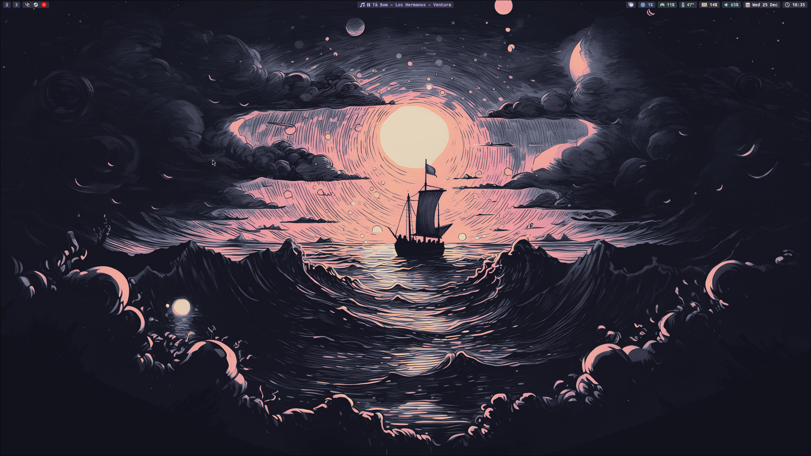
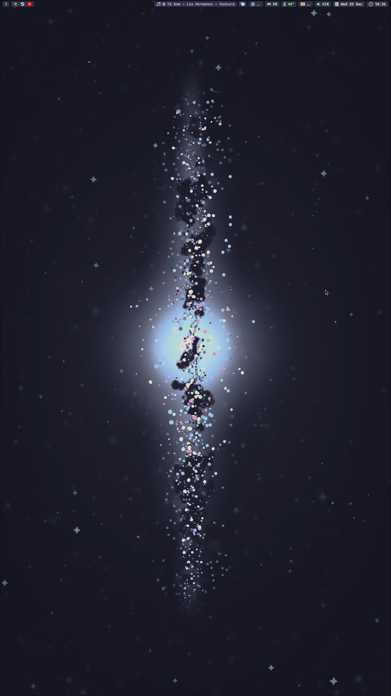

# Dotfiles

Personal dotfiles for [Hyprland](https://hyprland.org/) and Catppuccin Mocha
based theme.

|        |     |
|---------------------------------------|-------------------------------------|
|   |  |

<details>
  <summary>Portrait Monitor</summary>

  

</details>

## Dependencies

<details>
  <summary>AUR Helper</summary>

  ```bash
  sudo pacman -S --needed base-devel
  git clone https://aur.archlinux.org/paru.git
  cd paru
  makepkg -si
  ```

</details>

<details>
  <summary>Fonts</summary>

  ```bash
  sudo pacman -S ttf-fantasque-nerd ttf-jetbrains-mono-nerd ttf-nerd-fonts-symbols
  ```

</details>

<details>
  <summary>GTK Theme</summary>

  ```bash
  paru -S catppuccin-gtk-theme-mocha
  ```

</details>

<details>
  <summary>Hypr Ecosystem</summary>

  ```bash
  sudo pacman -S hyprland hyprpaper hyprlock xdg-desktop-portal-hyprland hyprutils
  ```

  ```bash
  paru -S hyprshot
  ```

</details>

<details>
  <summary>UI</summary>

  ```bash
  sudo pacman -S waybar rofi-wayland swaync
  ```

</details>

<details>
  <summary>Terminal Emulator</summary>

  ```bash
  sudo pacman -S wezterm
  ```

</details>

<details>
  <summary>File Managers</summary>

  ```bash
  sudo pacman -S yazi nautilus
  ```

</details>

<details>
  <summary>Misc</summary>

  ```bash
  sudo pacman -S fastfetch btop imv neovim lazygit
  ```

</details>

## Installation

Clone it in your home directory:

```bash
cd && git clone git@github.com:hbacelar8/.dotfiles.git
```

## Usage

In the .dotfiles directory, stow every config:

```bash
stow btop fastfetch hypr imv lazygit nvim rofi swaync waybar wezterm yazi
```
